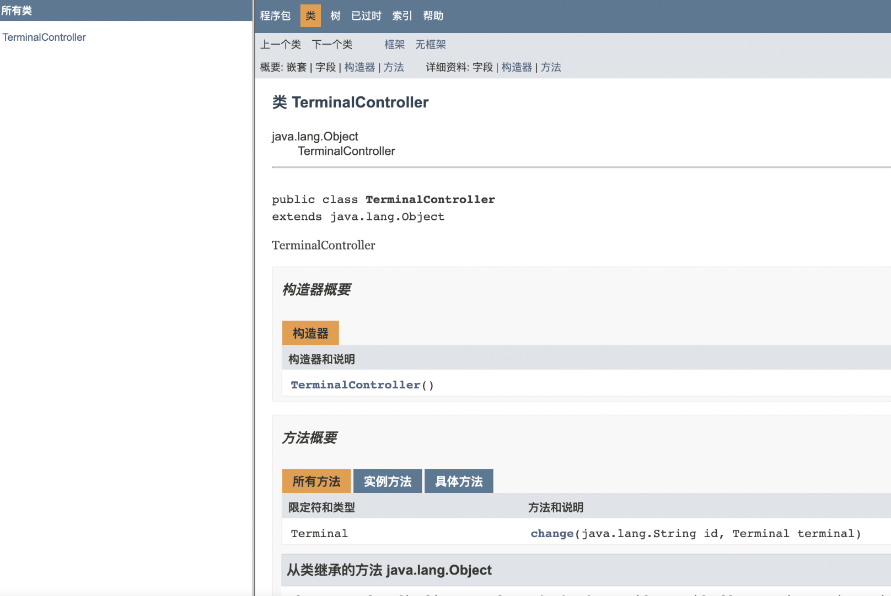
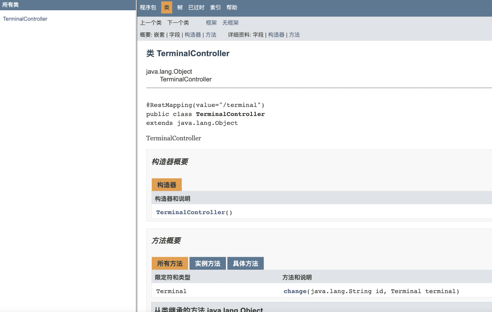
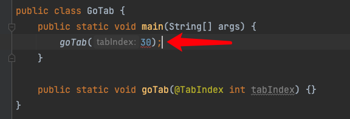
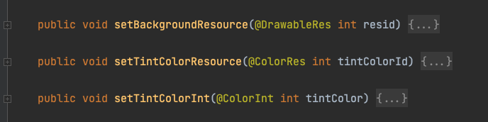
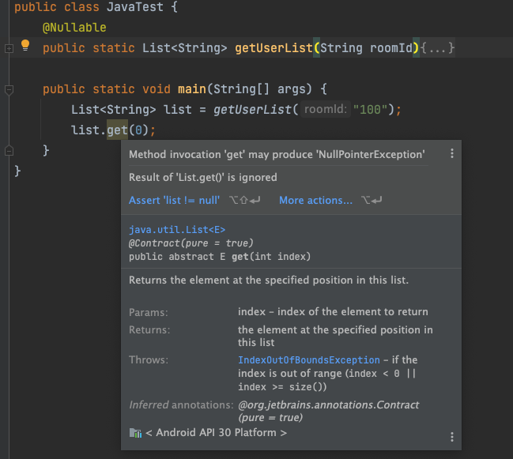
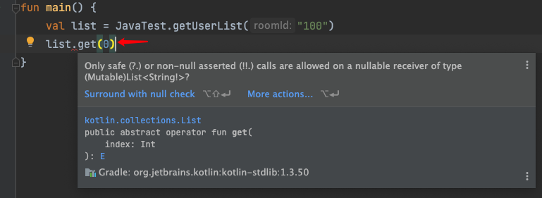
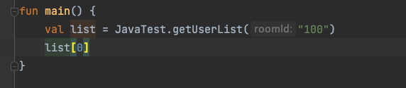

# java、Android 官方库给提供的常用注解

## java Android 标准库常用注解

**@Override**  
被编译器解释，在代码编写时做一些检查

**@Documented**  
被用来标记在注解上，在通过 javadoc 工具生成api文档时，文档上可以保留相关注解  

1. 自定义一个注解  
```java
@Target(ElementType.TYPE)
@Retention(RetentionPolicy.RUNTIME)
@Documented
public @interface RestMapping {
  String[] value() default {};

  String[] path() default {};
}
```
2. 测试类  
```java
@RestMapping("/terminal")
public class TerminalController {}
```

3. 生成 api 文档  
```java
// 生成 java doc 的命令：
javadoc -d doc TerminalController.java`
// -d <directory>  输出文件的目标目录
```

4. 不使用 `@Documented` 前，api 文档长这样  

  

5. 使用 `@Documented` 后，api 文档长这样  

  

**@SuppressWarnings**  
 用于关闭对类、方法、成员编译时产生的特定警告。

**@StringDef、@IntDef**   
```java
@IntDef({MAIN,STUDY,MINE})
@Target(ElementType.PARAMETER)
public @interface TabIndex {
    int MAIN = 0;
    int STUDY = 1;
    int MINE = 2;
}
```

IDE 提示错误  


**@DrawableRes、@ColorRes、@ColorInt、@LayoutRes、@IdRes**  
如果我们写一些方法入参是资源引用类型的，尽量用一些 Android 的标准注解，这样编译器可以帮你做一些检查，避免调用的时候传参错误


**@Nullable、@NonNull**  
如果一个方法被 @Nullable 标记，那么调用的时候用这个方法的返回对象去调用这个对象的另一个方法时，编译器就会给你警告<br/>  
  

如果是在 kotlin 中调用你这方法，编译器直接会给你报错  
<br/>


注解改为 `@NonNull` 以后，kotlin 调用方法就不在报错了，所以如果我们在 java 中写一些 public 的方法时候，如果可能返回 null，最好用注解标注一下。这样调用的时候编译器可能会给你一些警告  
<br/>


## 元注解
其实就是被用来标记在注解上的注解，我们在写自定义注解的时候会用到，常用的元注解  

`@Target` 标记注解可以用在什么地方，类、属性、方法、参数  
`@Retention` 标记注解保留策略，源码、编译时、运行时

### 使用元注解的例子

**路由框架中的 @Router**  
```java
@Target({ElementType.TYPE})
@Retention(RetentionPolicy.CLASS)
public @interface Router {
    String[] value();

    String[] paramReg() default {""};

    int priority() default 100;

    String module() default "";
}
```

**Retrofit 中的 @GET、@POST 等**  
```java
@Documented
@Target({ElementType.METHOD})
@Retention(RetentionPolicy.RUNTIME)
public @interface GET {
    String value() default "";
}
```